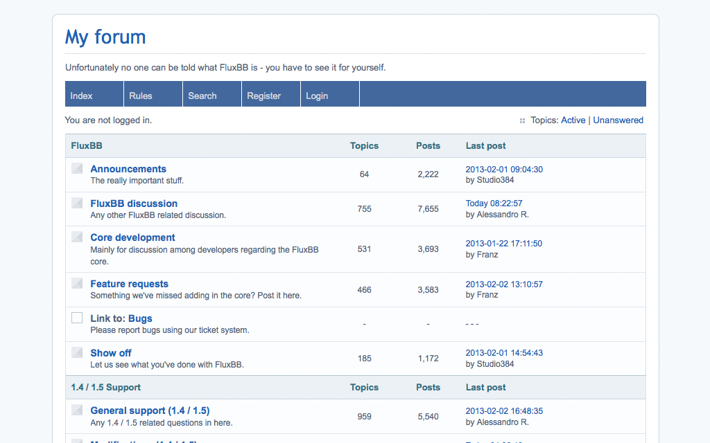

<!--
N.B.: This README was automatically generated by https://github.com/YunoHost/apps/tree/master/tools/README-generator
It shall NOT be edited by hand.
-->

# FluxBB for YunoHost

[](https://dash.yunohost.org/appci/app/fluxbb)    
[](https://install-app.yunohost.org/?app=fluxbb)

*[Lire ce readme en français.](./README_fr.md)*

> *This package allows you to install FluxBB quickly and simply on a YunoHost server.
If you don't have YunoHost, please consult [the guide](https://yunohost.org/#/install) to learn how to install it.*

## Overview

FluxBB is designed as a lighter, faster alternative to some of the traditional feature heavy forum applications. It is easy to use and has a proven track record of stability and security making it an ideal choice of forum for your website.


**Shipped version:** 1.5.11~ynh4

**Demo:** https://fluxbb.org/forums/index.php

## Screenshots



## Disclaimers / important information

### Limitations with YunoHost

HTTP and LDAP authentication are not supported.
## Documentation and resources

* Official app website: https://fluxbb.org/
* Official admin documentation: https://fluxbb.org/docs/
* Upstream app code repository: https://github.com/fluxbb/fluxbb/
* YunoHost documentation for this app: https://yunohost.org/app_fluxbb
* Report a bug: https://github.com/YunoHost-Apps/fluxbb_ynh/issues

## Developer info

Please send your pull request to the [testing branch](https://github.com/YunoHost-Apps/fluxbb_ynh/tree/testing).

To try the testing branch, please proceed like that.
```
sudo yunohost app install https://github.com/YunoHost-Apps/fluxbb_ynh/tree/testing --debug
or
sudo yunohost app upgrade fluxbb -u https://github.com/YunoHost-Apps/fluxbb_ynh/tree/testing --debug
```

**More info regarding app packaging:** https://yunohost.org/packaging_apps