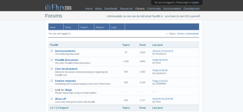

# FluxBB pour YunoHost


[](https://dash.yunohost.org/appci/app/FluxBB)  
[](https://install-app.yunohost.org/?app=FluxBB)

*[Read this readme in english.](./README.md)* 

> *Ce package vous permet d'installer FluxBB rapidement et simplement sur un serveur Yunohost.  
Si vous n'avez pas YunoHost, regardez [ici](https://yunohost.org/#/install) pour savoir comment l'installer et en profiter.*

## Vue d'ensemble

FluxBB est un forum de discussions écrit en PHP rapide et léger.

**Version incluse:** 1.5.11

## Captures d'écran



## Démo

* [Démo officielle](https://fluxbb.org/forums/index.php)

## Configuration

Comment configurer cette application: via le panneau d'administration.

## Documentation

 * Documentation officielle: https://fluxbb.org/docs/
 * Documentation YunoHost: https://yunohost.org/#/app_fluxbb

## Caractéristiques spécifiques YunoHost

#### Support multi-utilisateurs

L'authentification LDAP et HTTP est-elle prise en charge? non  
L'application peut-elle être utilisée par plusieurs utilisateurs? oui

#### Supported architectures

* x86-64b - [](https://ci-apps.yunohost.org/ci/apps/FluxBB/)
* ARMv8-A - [](https://ci-apps-arm.yunohost.org/ci/apps/FluxBB/)
* Jessie x86-64b - [](https://ci-stretch.nohost.me/ci/apps/FluxBB/)

## Limitations

* Limitations connues.

## Informations additionnelles

* Change-url : une fois l'url modifiée, allez dans le panneau de configuration pour modifier le champ `Base URL`

**Plus d'informations sur la page de documentation:**  
https://yunohost.org/packaging_apps

## Links

 * Signaler un bug: https://github.com/YunoHost-Apps/FluxBB_ynh/issues
 * Site de l'application: https://fluxbb.org/
 * Site web YunoHost: https://yunohost.org/

---

Informations pour les développeurs
----------------

**Seulement si vous voulez utiliser une branche de test pour le codage, au lieu de fusionner directement dans la banche principale.**
Merci de faire vos pull request sur la [branche testing](https://github.com/YunoHost-Apps/FluxBB_ynh/tree/testing).

Pour essayer la branche testing, procédez comme suit.
```
sudo yunohost app install https://github.com/YunoHost-Apps/FluxBB_ynh/tree/testing --debug
ou
sudo yunohost app upgrade FluxBB -u https://github.com/YunoHost-Apps/FluxBB_ynh/tree/testing --debug
```
