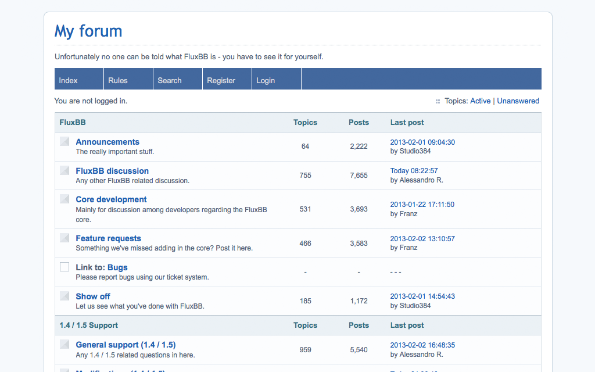

<!--
N.B.: README ini dibuat secara otomatis oleh <https://github.com/YunoHost/apps/tree/master/tools/readme_generator>
Ini TIDAK boleh diedit dengan tangan.
-->

# FluxBB untuk YunoHost

[](https://ci-apps.yunohost.org/ci/apps/fluxbb/)


[](https://install-app.yunohost.org/?app=fluxbb)

*[Baca README ini dengan bahasa yang lain.](./ALL_README.md)*

> *Paket ini memperbolehkan Anda untuk memasang FluxBB secara cepat dan mudah pada server YunoHost.*  
> *Bila Anda tidak mempunyai YunoHost, silakan berkonsultasi dengan [panduan](https://yunohost.org/install) untuk mempelajari bagaimana untuk memasangnya.*

## Ringkasan

FluxBB is designed as a lighter, faster alternative to some of the traditional feature heavy forum applications. It is easy to use and has a proven track record of stability and security making it an ideal choice of forum for your website.


**Versi terkirim:** 1.5.11~ynh1

**Demo:** <https://fluxbb.org/forums/index.php>

## Tangkapan Layar



## :red_circle: Antifitur

- **Upstream not maintained**: This software is not maintained anymore. Expect it to break down over time, be exposed to unfixed security breaches, etc.

## Dokumentasi dan sumber daya

- Website aplikasi resmi: <https://fluxbb.org/>
- Dokumentasi admin resmi: <https://fluxbb.org/docs/>
- Depot kode aplikasi hulu: <https://github.com/fluxbb/fluxbb/>
- Gudang YunoHost: <https://apps.yunohost.org/app/fluxbb>
- Laporkan bug: <https://github.com/YunoHost-Apps/fluxbb_ynh/issues>

## Info developer

Silakan kirim pull request ke [`testing` branch](https://github.com/YunoHost-Apps/fluxbb_ynh/tree/testing).

Untuk mencoba branch `testing`, silakan dilanjutkan seperti:

```bash
sudo yunohost app install https://github.com/YunoHost-Apps/fluxbb_ynh/tree/testing --debug
atau
sudo yunohost app upgrade fluxbb -u https://github.com/YunoHost-Apps/fluxbb_ynh/tree/testing --debug
```

**Info lebih lanjut mengenai pemaketan aplikasi:** <https://yunohost.org/packaging_apps>
